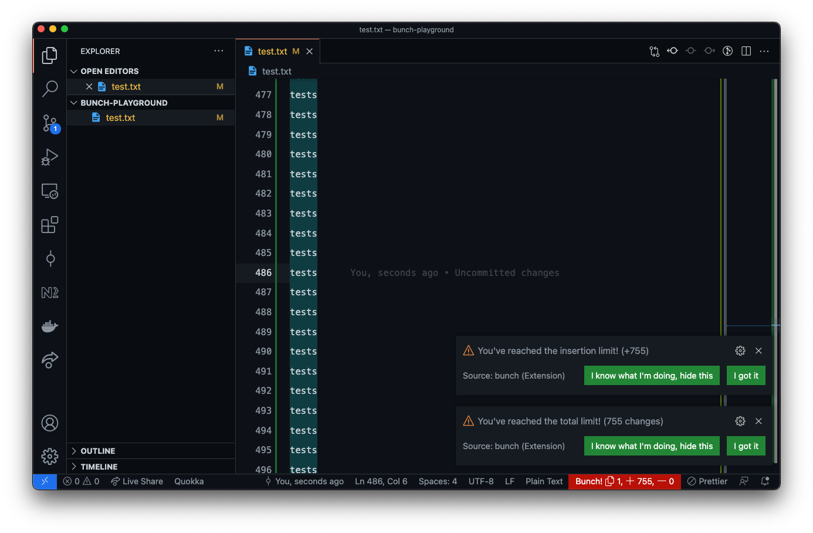

 
# Bunch!

The vscode extension for monitoring number of line changes for your git branch.

## Installation
---
Just search for `Bunch!` on vscode extension tab and install it!

## How to use ?
---
Bunch will start to watch changes and warn you if changes are over the limit right after vscode is started.

## How configure the limit and other settings ?
---
Open the command palette and type `Bunch: settings`

## Special Thanks
---
- [Adobe Spark Logo Maker](https://spark.adobe.com/express-apps/logomaker/) for a beautiful logo
